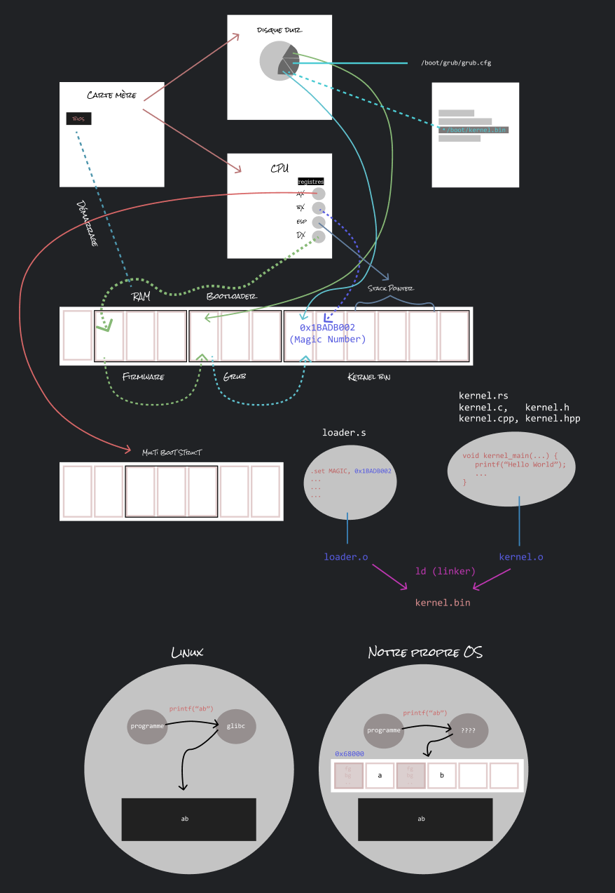
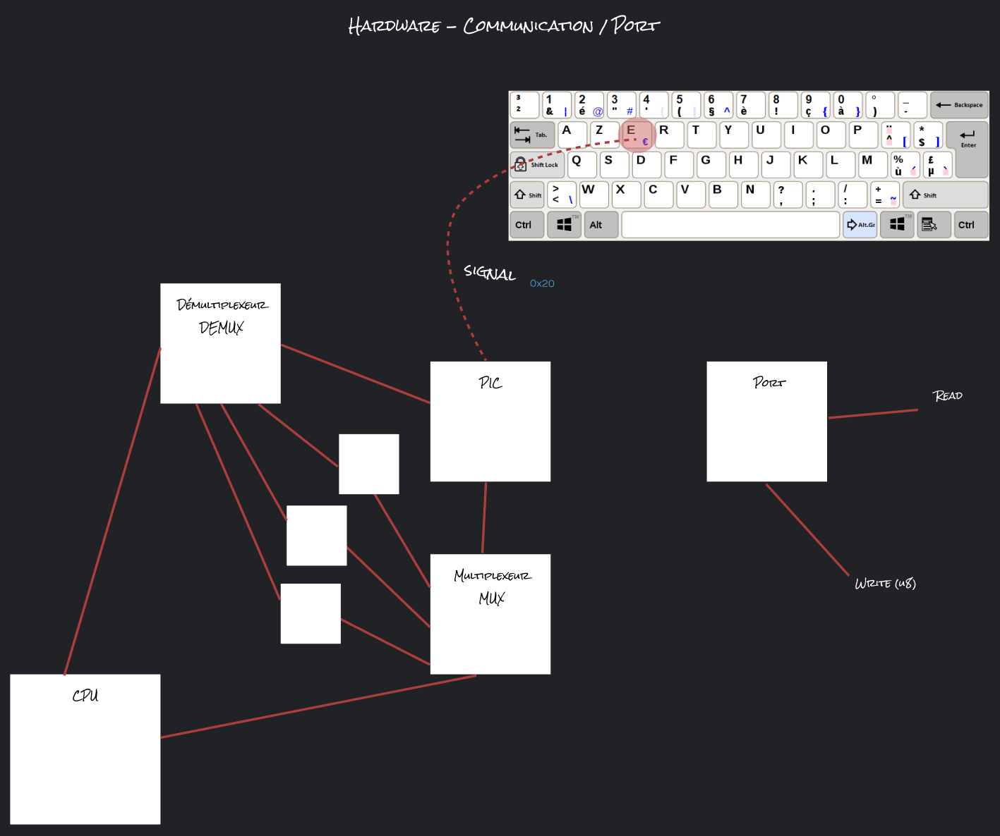
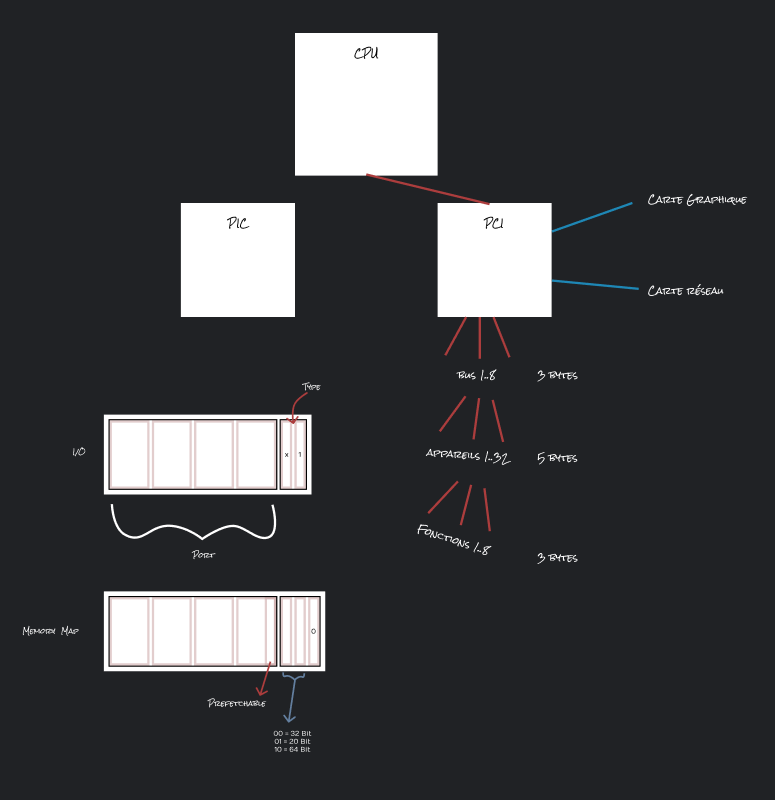

# OS

## Comment fonctionne un OS, expliqué, pas à pas, vulgairement, à un débutant.

## Segments de mémoire, table global de descripteurs.

## Matériel - Communication / Ports

## Interconnexion des composants périphériques (PCI & BAR)

